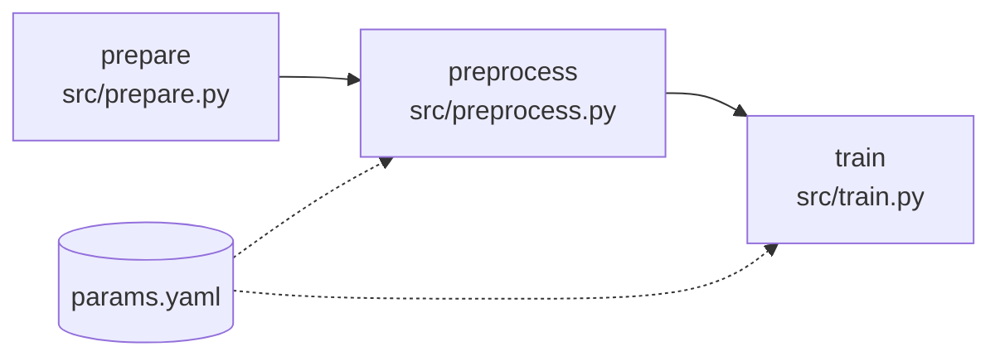

# Fashion MNIST ANN Pipeline

A reproducible machine learning pipeline that trains an artificial neural network (ANN) to classify Fashion-MNIST images. Source code is versioned with **Git**, while data, intermediate artifacts and model outputs are versioned with **DVC** and backed up to a Google Drive remote.


---

## Table of Contents

- [Overview](#overview)
- [Pipeline](#pipeline)
- [Project Structure](#project-structure)
- [Getting Started](#getting-started)
- [Usage](#usage)
- [Configuration](#configuration)
- [Results](#results)
- [Git Workflow](#git-workflow)
- [Remote Storage](#remote-storage)
- [Troubleshooting](#troubleshooting)
- [Author](#author)

---

## Overview

This project demonstrates a complete version-control and MLOps workflow for a small deep learning task:

- **Reproducibility:** every stage declares its dependencies, parameters and outputs, so results can be regenerated with a single command.
- **Efficiency:** DVC hashes dependencies and skips stages whose inputs have not changed.
- **Lightweight repository:** datasets and model artifacts are kept out of Git and stored on a remote.
- **Collaboration:** branching, rebasing and merge-conflict handling cover both source code and the DVC lock file.

## Pipeline

The workflow is defined as three DVC stages.



| Stage | Command | Description |
|---|---|---|
| `prepare` | `python src/prepare.py` | Loads the dataset and stores raw arrays under `data/raw/`. |
| `preprocess` | `python src/preprocess.py` | Scales pixel values to the range 0 to 1 (`/ 255.0`) and creates the train/validation split from `test_size` and `seed`. |
| `train` | `python src/train.py` | Trains the ANN for 10 epochs using the `dense_units` hyperparameter and logs accuracy and loss. |

> **Note:** normalization intentionally uses floating-point division (`/ 255.0`). Integer division (`// 255`) collapses nearly every pixel to 0 or 1 and destroys image information.

## Project Structure

```text
fashion-ann-pipeline/
├── .dvc/                # DVC configuration (remote: gdrive_storage)
├── .dvcignore
├── data/
│   └── raw/             # Raw arrays (tracked by DVC, not by Git)
├── src/
│   ├── prepare.py       # Stage 1: data preparation
│   ├── preprocess.py    # Stage 2: normalization and split
│   └── train.py         # Stage 3: model training
├── dvc.yaml             # Pipeline definition
├── dvc.lock             # Exact hashes of the last pipeline run
├── params.yaml          # Tunable parameters
└── README.md
```

## Getting Started

### Prerequisites

- Python 3.12
- Git
- Access to the project's Google Drive remote (a Google account with permission on the shared folder)

### Installation

```bash
# 1. Clone the repository
git clone https://github.com/MoazKashif/fashion-ann-pipeline.git
cd fashion-ann-pipeline

# 2. Create and activate a virtual environment
python3 -m venv venv
source venv/bin/activate

# 3. Install dependencies
pip install "dvc[gdrive]" tensorflow scikit-learn numpy pyyaml pandas
```

### Fetch the data

```bash
dvc pull
```

On first use DVC opens a Google authentication flow for the `gdrive_storage` remote.

## Usage

Run the full pipeline (only stages with changed inputs are executed):

```bash
dvc repro
```

Useful commands:

| Task | Command |
|---|---|
| Show pipeline status | `dvc status` |
| Show the stage graph | `dvc dag` |
| Compare remote and local data | `dvc status -c` |
| Upload new artifacts | `dvc push` |
| Download artifacts for the current commit | `dvc pull` |
| Switch to another experiment version | `git checkout v2 && dvc checkout` |

### Expected behaviour

If only a training hyperparameter changes, DVC prints the following and re-runs training only:

```text
Stage 'prepare' didn't change, skipping
Stage 'preprocess' didn't change, skipping
Running stage 'train':
> python src/train.py
```

## Configuration

Parameters are read from `params.yaml`.

| Parameter | Used by | Meaning |
|---|---|---|
| `test_size` | `preprocess` | Fraction of training data held out for validation. |
| `seed` | `preprocess` | Random seed for a reproducible split. |
| `dense_units` | `train` | Number of units in the dense hidden layer. |

Changing a value and running `dvc repro` re-executes only the affected stages.

## Results

Training runs on CPU. Two runs were recorded, tagged by the hyperparameter change introduced in `v2`:

| Run | Observed in log | Validation accuracy | Validation loss |
|---|---|---|---|
| v1 baseline | epoch 7 of 10 | 0.8795 | 0.3295 |
| v2 (`dense_units` updated) | epoch 5 of 10 | 0.8789 | 0.3372 |

Both runs reach roughly 88% validation accuracy within the first epochs, and training loss decreases steadily. Final 10-epoch figures are produced by `dvc repro`.

## Git Workflow

| Branch | Purpose |
|---|---|
| `main` | Stable, integrated code. |
| `dev` | Feature and pipeline development; rebased onto `main` to keep a linear history. |
| `hotfix` | Small isolated fixes (for example, a README typo). |
| `teammate-sim` | Simulated collaborator branch used to practise conflict resolution. |
| `scratch` | Disposable experiments (stash and reset practice). |

Release points are marked with tags (for example, `v2`).

**Resolving conflicts in a DVC project.** `dvc.lock` is a generated file. When a merge conflicts in both a script and `dvc.lock`:

1. Resolve the code conflict first (for example, keep `/ 255.0`).
2. Make `dvc.lock` consistent with the resolved code, for example by running `dvc repro`.
3. Stage both files and commit the merge.

> Rebasing rewrites commit hashes. Avoid rebasing branches that others already use, or push with `--force-with-lease` after a deliberate rebase.

## Remote Storage

The default DVC remote is `gdrive_storage`, a Google Drive folder configured in `.dvc/config`. Git stores only the small `.dvc` pointer files and `dvc.lock`; the data and model objects live on the remote.

After producing new outputs, always run:

```bash
dvc push
dvc status -c   # confirms the remote is up to date
```

## Troubleshooting

| Message | Explanation |
|---|---|
| `Could not find cuda drivers ... GPU will not be used` | No GPU is available; training falls back to CPU. This is expected and harmless. |
| `Allocation of ... exceeds 10% of free system memory` | Informational warning on low-memory machines. |
| `Do not pass an input_shape/input_dim argument to a layer` | Keras recommends starting a Sequential model with an `Input(shape)` object. Training is unaffected. |
| `Automatic merge failed` in `dvc.lock` | See [Git Workflow](#git-workflow) for the resolution steps. |

## Author

**Chaudary Moaz Kashif**
FAST-NUCES Lahore
[l232626@lhr.nu.edu.pk](mailto:l232626@lhr.nu.edu.pk) | [GitHub: MoazKashif](https://github.com/MoazKashif)
